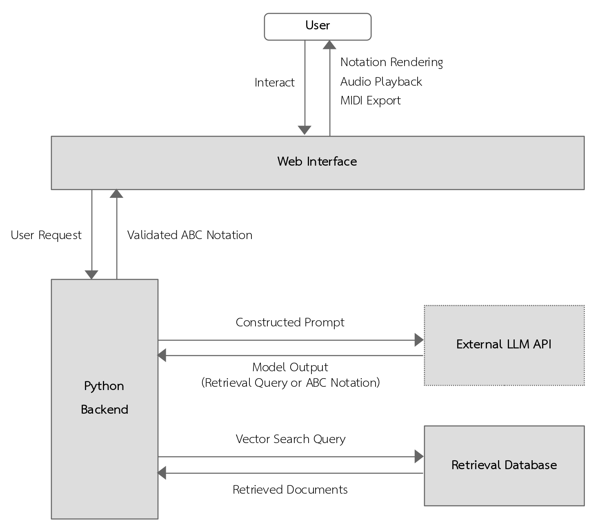

# Thai Music Assistant

A framework for generating traditional Thai music using LLMs and retrieval-augmented generation (RAG).

## Demo
- [https://tma.siammusiclab.com](https://tma.siammusiclab.com)
- [https://thai-music-assistant.vercel.app](https://thai-music-assistant.vercel.app) (alternative deployment)

## Overview

This project presents a framework for generating traditional Thai music from natural language input.

The system is implemented as a web application and supports interactive composition.

Instead of training a custom model, the system integrates:

- Large Language Model APIs
- Retrieval-Augmented Generation (RAG)
- A curated database of traditional Thai music

The system is designed as a human-in-the-loop creative tool, where users iteratively refine generated compositions.

## System Architecture

Main components:
- LLM APIs for generation
- Retrieval system for musical motives and theory
- Backend service for orchestration
- Web interface for interaction

Workflow:
1. User provides natural language input (e.g., mood).
2. The system constructs an internal prompt based on the user input
3. Relevant information is retrieved when needed:
   - musical motives
   - relevant theory
4. LLM generates music in ABC notation.
5. Output is parsed and converted to MIDI.

## Deployment Overview

The application is deployed as containerized services behind Traefik.

- Frontend and backend are isolated in separate containers.
- Traefik provides request routing and HTTPS handling.
- Services communicate through a shared Docker network (`tma_default`) provided by the hosting environment.

An alternative deployment using Vercel (frontend) and Render (backend) is also available.

## Implementation

- FastAPI (Python backend)
- LangChain (LLM orchestration)
- ChromaDB (vector database)
- React (web interface)

## Limitations

- Limited curated dataset (50 songs, curated).
- Retrieval is not optimized or evaluated quantitatively.
- Output depends on external LLM behavior.
- ABC notation simplifies musical expression.
- System performance has not been formally benchmarked.
